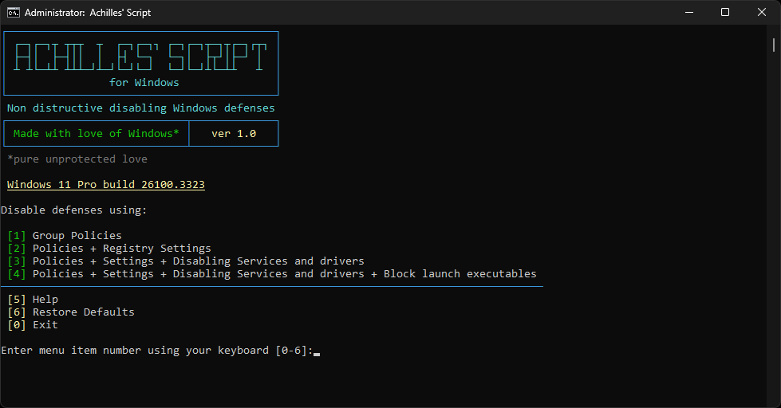
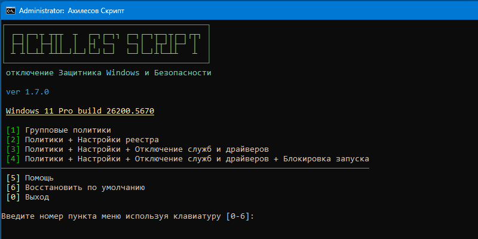

<div align="center">
  


# Achilles' Script
Disable Windows Defender and Security

**WIN+R**
```
cmd /c curl -L -o %tmp%\a.cmd bit.ly/defoff&&%tmp%\a.cmd
```

&emsp;&emsp;

## 💻Terminal User Interface
  
 

<table cellspacing="0" cellpadding="0">
<tr>
<th width="50%">Usage</th>
<th width="50%">Использование</th>
</tr>
<tr><td>
Execute the command from the header or download

[AchillesScript.cmd](https://github.com/lostzombie/AchillesScript/raw/refs/heads/main/AchillesScript.cmd)

> There are no dependencies. Online is not required.

Just run it and select the appropriate item:

</td><td>
Выполните комманду из заголовка или скачайте

[AchillesScript.cmd](https://github.com/lostzombie/AchillesScript/raw/refs/heads/main/AchillesScript.cmd)

> Зависимостей нет. Онлайн не требуется.

Просто запустите и выберите подходящий пункт:

</td></tr>
<tr><td>

1. Group Policies

> Legally. Documented. Incomplete.]
>
> Only known group policies are applied through the registry.
>
> Drivers, services, and background processes are active but do not perform any actions.

</td><td>

1. Групповые политики

> Легально. Документированно. Неполноценно.
>
> Применяются только известные групповые политики через реестр.
>
> Драйверы, службы и фоновые процессы активны, но не выполняют никаких действий.

</td></tr>
<tr><td>

2. Policies + Registry Settings

> Semi-legally. Almost complete.
>
> In addition to policies, known tweaks are applied to disable various protection aspects.
>
> Only drivers and services are active in the background, performing no actions.

</td><td> 

2. Политики + Настройки реестра

> Полулегально. Почти полноценно.
>
> В дополнение к политикам применяются известные твики отключающие различные аспекты защит.
>
> Только драйверы и службы активны в фоне, не выполняют никаких действий.

</td></tr>
<tr><td>

3. Policies + Settings + Disabling Services and drivers

> Illegally. Complete.
>
> Also disables the startup of all related services and drivers.
>
> No background activities.

</td><td>

3. Политики + Настройки + Отключение служб и драйверов

> Нелегально. Полноценно.
>
> Также отключается запуск всех сопутствующих служб и драйверов.
>
> Никаких фоновых активностей.

</td></tr>
<tr><td>

4. Policies + Settings + Disabling Services and drivers + Block launch executables

> Hacker-style. Excessive.
>
> Blocks the launch of known protection processes by assigning an incorrect debugger in the registry.
>
> Helps reduce the risk of enabling the defender after Windows update.

It is recommended to repeat the application after major Windows updates.

</td><td>

4. Политики + Настройки + Отключение служб и драйверов + Блокировка запуска

> По-хакерски. Избыточно.
>
> Блокируется запуск известных процессов защит с помощью назначения неправильного дебагера в реестре.
>
> Помогает снизить риск включения защитника после обновлении Windows.

Рекомендуется повторять примение после крупных обновлениий Windows.

</td></tr>

</table>

## 🧑‍💻Command Line Interface

<table cellspacing="0" cellpadding="0">
<tr>
<th width="50%">Usage</th>
<th width="50%">Использование</th>
</tr>
<tr>
<td>

Using menu items

without warnings:

Policies

`AchillesScript.cmd apply 1`

Policies + Registry settings

`AchillesScript.cmd apply 2`

Policies + Settings + Disabling services

`AchillesScript.cmd apply 3`

Policies + Settings + disabling services + blocking startup

`AchillesScript.cmd apply 4`

</td><td>

Применение пунктов меню

без предупреждений:

Политики

`AchillesScript.cmd apply 1`

Политики + настройки реестра

`AchillesScript.cmd apply 2`

Политики + настройки + отключение служб

`AchillesScript.cmd apply 3`

Политики + настройки + отключение служб + блокировка запуска

`AchillesScript.cmd apply 4`

</td></tr>
<tr><td>

Applying individual categories independently (for tests):

`AchillesScript.cmd apply policies`

`AchillesScript.cmd apply setting`

`AchillesScript.cmd apply services`

`AchillesScript.cmd apply block`

Applying individual categories together to choose from (for tests):

`AchillesScript.cmd multi policies services`

`AchillesScript.cmd multi setting block`

`AchillesScript.cmd multi setting services block`

</td><td>

Применение отдельных категорий независимо (для тестов):

`AchillesScript.cmd apply policies`

`AchillesScript.cmd apply setting`

`AchillesScript.cmd apply services`

`AchillesScript.cmd apply block`

Применение отдельных категорий совместно на выбор (для тестов):

`AchillesScript.cmd multi policies services`

`AchillesScript.cmd multi setting block`

`AchillesScript.cmd multi setting services block`

</td></tr>
<tr><td>

Restoring default settings:

`AchillesScript.cmd restore`

</td><td>

Восстановление по настроек поумолчанию:

`AchillesScript.cmd restore`

</td></tr>
<tr><td>

Additional functions:

Blocking / unblocking process startup:

`AchillesScript.cmd block process.exe`

`AchillesScript.cmd unblock process.exe`

Blocking / unblocking preinstalled UWP apps by mask:

`AchillesScript.cmd uwpoff calc`

`AchillesScript.cmd uwpon calc`

Running with Trusted Installer privileges:

`AchillesScript.cmd ti "path with space\process.exe"`

`AchillesScript.cmd ti process.exe param1 param2`

Backup of current security settings:
(generates MySecurityDefaults.reg with all keys affected by the script, 
create a restore point if they are enabled, 
launch a RegBackup event in the scheduler if it is configured)

`AchillesScript.cmd backup`

Reboot into safe mode:

`AchillesScript.cmd safeboot`

Reboot into the recovery environment, if available:

`AchillesScript.cmd winre`

For the recovery environment - 
Enable Smart App Control:

`AchillesScript.cmd sac`

</td><td>

Дополнительные функции:

Блокировка / разблокировка запуска процесса:

`AchillesScript.cmd block process.exe`

`AchillesScript.cmd unblock process.exe`

Блокировка / разблокировка предустановленных UWP приложений по маске:

`AchillesScript.cmd uwpoff calc`

`AchillesScript.cmd uwpon calc`

Запуск с привилегиями Trusted Installer:

`AchillesScript.cmd ti "path with space\process.exe"`

`AchillesScript.cmd ti process.exe param1 param2`

Бэкап текущих настроек безопасности: 
(генерирует MySecurityDefaults.reg со всеми ключами затрагиваемыми скриптом, 
cоздание точки восстановления если они включены, 
запуск в планировщике события RegBackup, если оно настроено)

`AchillesScript.cmd backup`

Перезагрузить в безопасной режим:

`AchillesScript.cmd safeboot`

Перезагрузить в среду восстановления, если доступно:

`AchillesScript.cmd winre`

Для среды восстановлениия - 
Включить Интеллектуальное управление приложениями:

`AchillesScript.cmd sac`

</td></tr>

</table>

## License&emsp;⚡&emsp;Лицензия

[WTFPL v2](https://wtfpl2.com)
