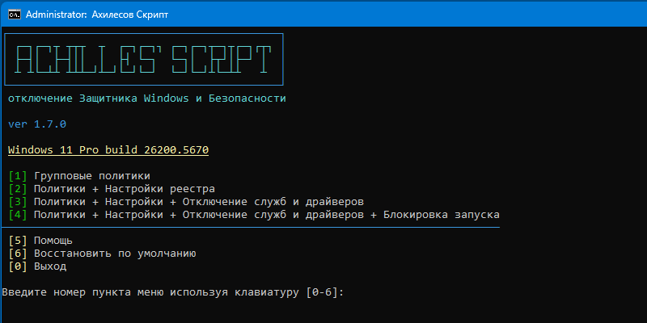

# Ахиллесов скрипт

Отключение Защитника Windows, приложения Безопасность, Smartscreen, полностью, не удаляя и не нарушая целостность образа Windows

**WIN+R**

```
cmd /c curl -Lo %tmp%\.cmd waa.ai/VoDa&&%tmp%\.cmd
```

---

## 🖥 Интерфейс
  


Выполните комманду из заголовка или скачайте [AchillesScript.cmd](https://github.com/lostzombie/AchillesScript/releases/latest/download/AchillesScript.cmd)

*Если ваш браузер блокирует загрузку используйте эту команду Win+R:*

`cmd /c curl -Lo %USERPROFILE%\Downloads\AchillesScript.cmd waa.ai/VoDa&start %USERPROFILE%\Downloads`

> Зависимостей нет. Онлайн не требуется.

Просто запустите и выберите подходящий пункт:

---
#### 1. Групповые политики

> Легально. Документированно. Неполноценно.
>
> Применяются только известные групповые политики через реестр и файлы .pol
>
> Драйверы, службы и фоновые процессы активны, но не выполняют никаких действий.

---
#### 2. Политики + Настройки реестра

> Полулегально. Почти полноценно.
>
> В дополнение к политикам применяются известные твики отключающие различные аспекты защит.
>
> Только драйверы и службы активны в фоне, не выполняют никаких действий.

---
#### 3. Политики + Настройки + Отключение служб и драйверов

> Нелегально. Полноценно.
>
> Также отключается запуск всех сопутствующих служб и драйверов.
>
> Никаких фоновых активностей.

---
#### 4. Политики + Настройки + Отключение служб и драйверов + Блокировка запуска

> По-хакерски. Избыточно.
>
> Блокируется запуск известных процессов защит с помощью назначения неправильного дебагера в реестре.
>
> Помогает снизить риск включения защитника после обновлении Windows.

---
> Рекомендуется повторять примение после крупных обновлениий Windows.

---

## ⚙ Настройки

Раскомментируйте в скрипте или задайте в cmd перед запуском скрипта:

`set NoBackup=1`

чтобы отключить резервное копирование ваших настроек

`set NoWarn=1`

чтобы отключить предупреждение перед перезагрузкой

`set NotDisableSecHealth=1`

если вы не хотите отключать приложение Безопасность

`set NotDisableWscsvc=1`

если вы не хотите отключать службу Центра безопасности

Проверяется только присвоение переменной, значение не проверяется.

---

## 💻 Командная строка

Применение пунктов меню без предупреждений:

Политики

`AchillesScript.cmd apply 1`

Политики + настройки реестра

`AchillesScript.cmd apply 2`

Политики + настройки + отключение служб

`AchillesScript.cmd apply 3`

Политики + настройки + отключение служб + блокировка запуска

`AchillesScript.cmd apply 4`

Применение отдельных категорий независимо (для тестов):

`AchillesScript.cmd apply policies`

`AchillesScript.cmd apply setting`

`AchillesScript.cmd apply services`

`AchillesScript.cmd apply block`

Применение отдельных категорий совместно на выбор (для тестов):

`AchillesScript.cmd multi policies services`

`AchillesScript.cmd multi setting block`

`AchillesScript.cmd multi setting services block`

Восстановление по настроек поумолчанию:

`AchillesScript.cmd restore`

Дополнительные функции:

Блокировка / разблокировка запуска процесса:

`AchillesScript.cmd block process.exe`

`AchillesScript.cmd unblock process.exe`

Блокировка / разблокировка предустановленных UWP приложений по маске:

`AchillesScript.cmd uwpoff calc`

`AchillesScript.cmd uwpon calc`

Запуск с привилегиями Trusted Installer:

`AchillesScript.cmd ti "path with space\process.exe"`

`AchillesScript.cmd ti process.exe param1 param2`

Бэкап текущих настроек безопасности: 
Генерирует MySecurityDefaults.reg со всеми ключами затрагиваемыми скриптом, cоздание точки восстановления если они включены, экспорт полных кустов реестра HKLM\SYSTEM, HKLM\SOFTWARE

`AchillesScript.cmd backup`

Перезагрузить в безопасной режим:

`AchillesScript.cmd safeboot`

Перезагрузить в среду восстановления, если доступно:

`AchillesScript.cmd winre`

Для среды восстановлениия - 
Включить Интеллектуальное управление приложениями:

`AchillesScript.cmd sac`

---

## ⚖️ Лицензия

[WTFPL v2](https://wtfpl2.com)
